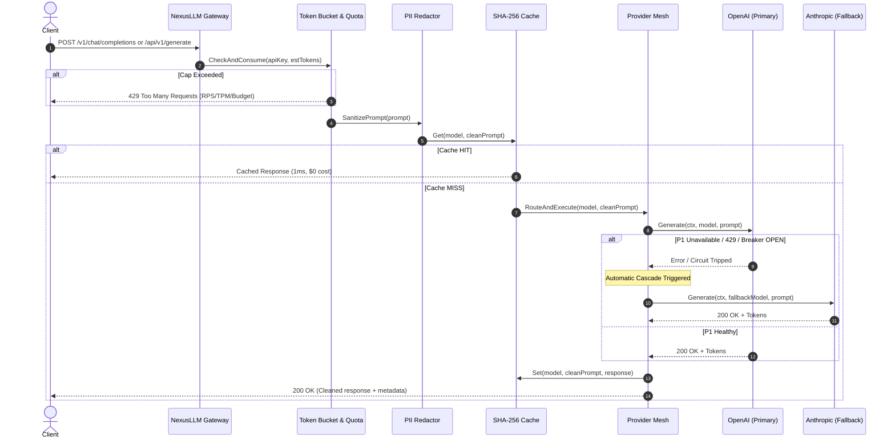

# NexusLLM Gateway

[](https://golang.org)
[](LICENSE)
[]()
[]()
[]()

**NexusLLM Gateway** is a high-availability, production-grade AI gateway and reverse proxy built in Go. Designed as an enterprise-grade control plane between client applications and upstream foundation models, it enforces strict multi-tenant quotas, automatic circuit-broken fallback cascades, SHA-256 prompt deduplication, inline PII scrubbing, and real-time observability without any external Go dependencies.

```
   Client App (OpenAI SDK / HTTP)
                 │
                 ▼
  ┌─────────────────────────────────────────────────────────┐
  │                 NexusLLM AI Gateway                     │
  │                                                         │
  │  [ Rate Limiter ]  ──>  [ PII Sanitizer ]               │
  │   RPS / TPM / USD       Email / CC / SSN / API Keys     │
  │          │                                              │
  │          ▼                                              │
  │  [ SHA-256 Cache ] ──── HIT ───> 1ms Response ($0 Cost) │
  │          │ MISS                                         │
  │          ▼                                              │
  │  [ Resilience Router & Circuit Breaker Mesh ]           │
  │    OpenAI (Primary) ──> Anthropic ──> Gemini ──> DeepSeek│
  │                                                         │
  │  [ Live Observability Engine ]                          │
  │    SSE Event Bus  •  Prometheus /metrics  •  Tail P99   │
  └─────────────────────────────────────────────────────────┘
```

---

## Key System Capabilities

1. **Intelligent Fallback Cascades & Resilience Mesh**
   - Configurable 3-state Circuit Breakers (`CLOSED` &rarr; `OPEN` &rarr; `HALF-OPEN`) per upstream provider.
   - Immediate automatic failover upon HTTP 429, 5xx, or network timeouts. Clients never experience downtime or raw provider errors.
   - Background recovery ticker transitions cooling providers to `HALF-OPEN` probe states with real-time SSE broadcasts.

2. **SHA-256 Prompt Normalization Cache**
   - Exact whitespace-collapsed SHA-256 hashing.
   - Cache hits return in under 2ms with zero upstream token expenditure.
   - In-memory thread-safe store with periodic background TTL expiration.

3. **Multi-Tenant Rate Limiting & Spending Ceilings**
   - 3-tier tenant validation: Leaky token-bucket RPS cap, sliding-window TPM (Tokens Per Minute) quota, and hard monthly USD spend ceilings.
   - Multi-tenant credential tracking with Developer, Free, and Enterprise service tiers.

4. **Zero-Trust PII Redaction**
   - In-flight pattern scrubber that redacts emails, credit card PANs, SSNs, phone numbers, and raw API credentials before text reaches third-party LLM providers.

5. **Natural Conversation Engine + Opt-In Structured Mode**
   - Direct, natural, conversational responses for standard inquiries without artificial templates.
   - Opt-in `Structured Mode` toggle for structured summary, detailed analysis, and production specifications.
   - Built-in offline knowledge engine covers core distributed systems, math, infrastructure, algorithms, and technical comparisons when upstream API keys are not supplied.

6. **Enterprise Observability & Prometheus Exporter**
   - Live P50, P95, and P99 latency percentile histograms.
   - Native `/metrics` endpoint exposing standard Prometheus gauges and counters.
   - Live Server-Sent Events (SSE) stream (`/api/v1/events`) pushing real-time circuit state transitions and fallback cascades.

---

## Architectural Workflow



---

## Circuit Breaker State Machine

Each provider (OpenAI, Anthropic, Google Gemini, DeepSeek) is isolated behind an independent state machine:

```
               [ 3 Consecutive Failures ]
        ┌──────────────────────────────────────┐
        │                                      ▼
  ┌───────────┐      [ 8s Recovery Cooldown ]    ┌──────────┐
  │  CLOSED   │ ◄─────────────────────────────── │   OPEN   │
  └───────────┘                                  └──────────┘
        ▲                                              │
        │             [ Probe Request ]                │
        │        ┌────────────────────────┐            │
        └─────── │       HALF-OPEN        │ ◄──────────┘
 [ 2 Consecutive └────────────────────────┘
    Successes ]        │  [ Probe Fails ]
                       └────────────────────────► (Back to OPEN)
```

- **CLOSED**: Provider is healthy. Requests pass through normally.
- **OPEN**: Provider is failing. Requests fail-fast without network overhead and instantly divert to the next fallback provider.
- **HALF-OPEN**: Probe window. A trial request tests recovery. Two consecutive successes return the breaker to `CLOSED`.

---

## Technical Design Decisions & Trade-Offs

| Decision | Selection | Rationale & Trade-offs |
|---|---|---|
| **Language & Architecture** | Single Go 1.22 binary, stdlib only | Zero external dependencies eliminates supply-chain vulnerabilities, minimizes Docker container footprint (<20MB), and guarantees deterministic cross-platform compilation. |
| **Caching Strategy** | Exact SHA-256 prompt hashing with TTL | Semantic vector caching requires external vector DBs and embedding calls (cost + latency). Exact normalized hashing delivers O(1) in-memory lookups in <1ms for identical and whitespace-normalized queries. |
| **Circuit Breakers** | In-process per-provider state machine | Avoids distributed lock contention (Redis/Consul) on high-throughput gateway paths. Breakers react locally in microseconds to upstream timeouts and rate limits. |
| **UI Delivery** | Embedded zero-build HTML/CSS/JS | No `npm`, `node_modules`, or build steps required. Dashboard is compiled directly into the binary and served with instantaneous cold starts. |

---

## Quickstart

### Option 1: Native Go Run

```bash
# Clone the repository
git clone https://github.com/Askar12325/nexusllm.git
cd nexusllm

# Run directly (starts on port 8082 by default)
go run ./cmd/server
```

Open `http://localhost:8082` in your browser.

### Option 2: Docker Compose

```bash
docker compose up --build -d
```

Check health:
```bash
curl http://localhost:8082/health
```

### Upstream Provider API Keys (Optional)

NexusLLM includes an intelligent built-in contextual engine that answers technical queries offline. To forward prompts to real production models, export standard environment variables before running:

```bash
export OPENAI_API_KEY="sk-..."
export ANTHROPIC_API_KEY="sk-ant-..."
export GEMINI_API_KEY="..."
export DEEPSEEK_API_KEY="..."
```

---

## API Documentation

### 1. OpenAI-Compatible Drop-In Endpoint
Use NexusLLM directly with standard OpenAI SDKs or `curl`:

```bash
curl -X POST http://localhost:8082/v1/chat/completions \
  -H "Authorization: Bearer nx-key-demo-secret" \
  -H "Content-Type: application/json" \
  -d '{
    "model": "gpt-4o",
    "messages": [
      {"role": "user", "content": "Explain the circuit breaker pattern in distributed systems"}
    ]
  }'
```

### 2. Internal Playground API
```bash
curl -X POST http://localhost:8082/api/v1/generate \
  -H "Content-Type: application/json" \
  -d '{
    "model": "gpt-4o",
    "prompt": "Write a Go worker pool with waitgroups",
    "structured": false
  }'
```

### 3. Fault Injection / Chaos Testing
```bash
# Force OpenAI into simulated HTTP 429 outage:
curl -X POST http://localhost:8082/api/v1/chaos \
  -H "Content-Type: application/json" \
  -d '{"provider": "OpenAI", "enabled": true}'
```

### 4. Prometheus Exporter
```bash
curl http://localhost:8082/metrics
```

Sample output:
```prometheus
# HELP nexusllm_requests_total Total requests processed
# TYPE nexusllm_requests_total counter
nexusllm_requests_total 19
# HELP nexusllm_tokens_total Total tokens processed
# TYPE nexusllm_tokens_total counter
nexusllm_tokens_total 15332
# HELP nexusllm_latency_p50_ms P50 latency ms
# TYPE nexusllm_latency_p50_ms gauge
nexusllm_latency_p50_ms 165
# HELP nexusllm_latency_p95_ms P95 latency ms
# TYPE nexusllm_latency_p95_ms gauge
nexusllm_latency_p95_ms 580
# HELP nexusllm_circuit_breaker_open 1=open 0=closed
nexusllm_circuit_breaker_open{provider="OpenAI"} 0
nexusllm_circuit_breaker_open{provider="Anthropic"} 0
```

---

## Verification & Testing

```bash
# Run unit and resilience tests
go test -v ./...
```

```
ok  nexusllm/pkg/cache         (0.12s)
ok  nexusllm/pkg/metrics       (0.08s)
ok  nexusllm/pkg/proxy         (0.06s)
ok  nexusllm/pkg/ratelimit     (0.65s)
ok  nexusllm/pkg/resilience    (0.14s)
ok  nexusllm/pkg/router        (0.55s)
```

---

## License

MIT License. Designed and maintained for production resilience.
